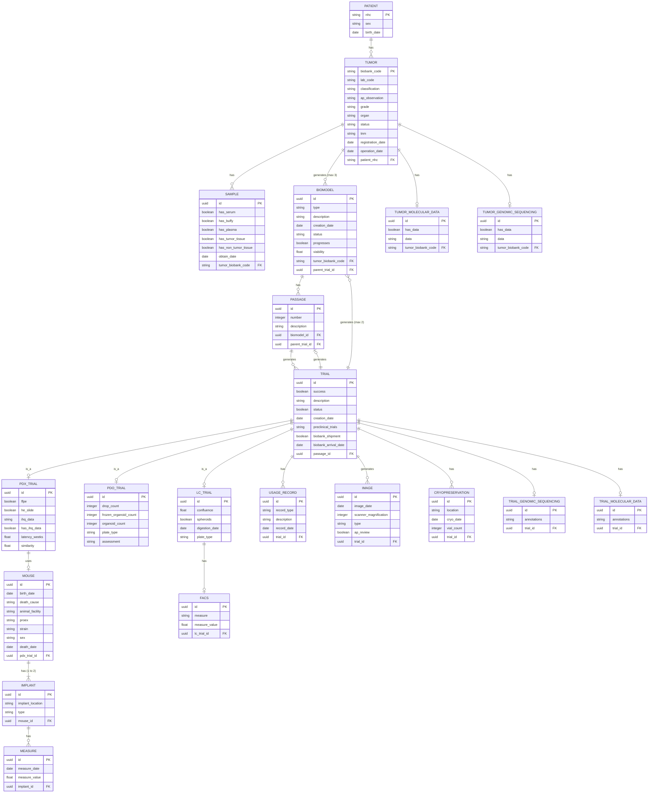

# TechConnect Backend Data Model

## Entity Relationship Diagram

```mermaid
erDiagram
    PATIENT ||--o{ TUMOR : "has"
    TUMOR ||--o{ SAMPLE : "has"
    TUMOR ||--o{ BIOMODEL : "generates (max 3)"
    TUMOR ||--o| TUMOR_MOLECULAR_DATA : "has"
    TUMOR ||--o| TUMOR_GENOMIC_SEQUENCING : "has"
    BIOMODEL ||--o{ PASSAGE : "has"
    PASSAGE ||--o{ TRIAL : "generates"
    TRIAL ||--o{ BIOMODEL : "generates (max 2)"
    TRIAL ||--o| PASSAGE : "generates"

    TRIAL ||--o| PDX_TRIAL : "is_a"
    TRIAL ||--o| PDO_TRIAL : "is_a"
    TRIAL ||--o| LC_TRIAL : "is_a"

    TRIAL ||--o{ USAGE_RECORD : "has"
    TRIAL ||--o{ IMAGE : "generates"
    TRIAL ||--o{ CRYOPRESERVATION : "has"
    TRIAL ||--o| TRIAL_GENOMIC_SEQUENCING : "has"
    TRIAL ||--o| TRIAL_MOLECULAR_DATA : "has"

    PDX_TRIAL ||--o| MOUSE : "uses"
    MOUSE ||--|{ IMPLANT : "has (1 to 2)"
    IMPLANT ||--o{ MEASURE : "has"

    LC_TRIAL ||--o| FACS : "has"

    PATIENT {
        string nhc PK
        string sex
        date birth_date
    }

    TUMOR {
        string biobank_code PK
        string lab_code
        string classification
        string ap_observation
        string grade
        string organ
        string status
        string tnm
        date registration_date
        date operation_date
        string patient_nhc FK
    }

    SAMPLE {
        uuid id PK
        boolean has_serum
        boolean has_buffy
        boolean has_plasma
        boolean has_tumor_tissue
        boolean has_non_tumor_tissue
        date obtain_date
        string tumor_biobank_code FK
    }

    BIOMODEL {
        uuid id PK
        string type
        string description
        date creation_date
        string status
        boolean progresses
        float viability
        string tumor_biobank_code FK
        uuid parent_trial_id FK
    }

    PASSAGE {
        uuid id PK
        integer number
        string description
        uuid biomodel_id FK
        uuid parent_trial_id FK
    }

    TRIAL {
        uuid id PK
        boolean success
        string description
        boolean status
        date creation_date
        string preclinical_trials
        boolean biobank_shipment
        date biobank_arrival_date
        uuid passage_id FK
    }

    PDX_TRIAL {
        uuid id PK
        boolean ffpe
        boolean he_slide
        string ihq_data
        boolean has_ihq_data
        float latency_weeks
        float similarity
    }

    PDO_TRIAL {
        uuid id PK
        integer drop_count
        integer frozen_organoid_count
        integer organoid_count
        string plate_type
        string assessment
    }

    LC_TRIAL {
        uuid id PK
        float confluence
        boolean spheroids
        date digestion_date
        string plate_type
    }

    USAGE_RECORD {
        uuid id PK
        string record_type
        string description
        date record_date
        uuid trial_id FK
    }

    IMAGE {
        uuid id PK
        date image_date
        integer scanner_magnification
        string type
        boolean ap_review
        uuid trial_id FK
    }

    CRYOPRESERVATION {
        uuid id PK
        string location
        date cryo_date
        integer vial_count
        uuid trial_id FK
    }

    TUMOR_GENOMIC_SEQUENCING {
        uuid id PK
        boolean has_data
        string data
        string tumor_biobank_code FK
    }

    TUMOR_MOLECULAR_DATA {
        uuid id PK
        boolean has_data
        string data
        string tumor_biobank_code FK
    }

    TRIAL_GENOMIC_SEQUENCING {
        uuid id PK
        string annotations
        uuid trial_id FK
    }

    TRIAL_MOLECULAR_DATA {
        uuid id PK
        string annotations
        uuid trial_id FK
    }

    IMPLANT {
        uuid id PK
        string implant_location
        string type
        uuid mouse_id FK
    }

    MEASURE {
        uuid id PK
        date measure_date
        float measure_value
        uuid implant_id FK
    }

    MOUSE {
        uuid id PK
        date birth_date
        string death_cause
        string animal_facility
        string proex
        string strain
        string sex
        date death_date
        uuid pdx_trial_id FK
    }

    FACS {
        uuid id PK
        string measure
        float measure_value
        uuid lc_trial_id FK
    }
```
